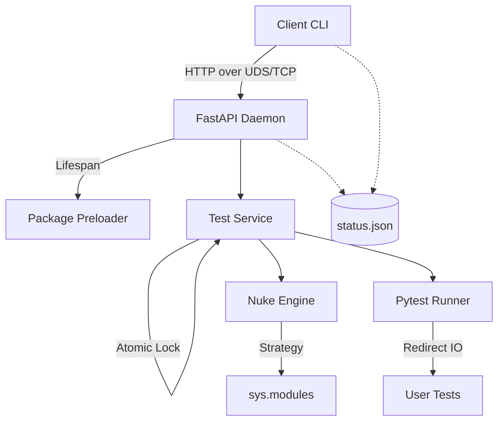

# Sprintest

[](https://pypi.org/project/sprintest/)
[](https://opensource.org/licenses/MIT)
[](https://www.python.org/downloads/)

[English] | [简体中文](README_zh.md)

**Sprintest** is a high-performance Client-Server (C/S) architecture test runner specifically engineered for heavy AI/ML projects. 

In projects involving large language models (LLMs), deep learning frameworks (PyTorch, TensorFlow), or massive datasets, standard test runners suffer from excruciatingly slow startup times (often 30s to several minutes) because they re-initialize the entire environment for every run. **Sprintest solves this by keeping your heavy dependencies pre-loaded in memory.**

---

## 🚀 Key Highlights

- **⚡ Blazing Fast Feedback**: Reduces test startup time from minutes to milliseconds by keeping heavy frameworks and models pre-loaded in a background daemon.
- **🔄 Intelligent Hot-Reloading**: Features a "Nuke Engine" that surgically unloads only your project's modified modules, ensuring you always test against the latest code without losing the pre-loaded state.
- **🔌 Unified Transport Layer**: Automatically chooses between **Unix Domain Sockets (UDS)** for zero-latency local communication and **TCP** for maximum compatibility.
- **🛠️ Decoupled Architecture**: Built with a robust service layer and atomic state management, ensuring stable communication even during heavy test execution.
- **🤖 Agent-Optimized**: Designed for AI coding agents (like Antigravity or Cursor) with clean, ANSI-free output and reliable status tracking.
- **🎯 Configurable Strategy**: Fine-tune hot-reloading with `ignore_patterns` in your `pyproject.toml` to prevent specific heavy modules from being reloaded.

---

## 🏗️ Architecture

Sprintest uses a decoupled architecture to ensure the daemon remains responsive even when running heavy tests.



---

## 📦 Installation

```bash
pip install sprintest
```

---

## 📖 Quick Start

1. **Run a test**:
   Simply run `stest` followed by your test file. If the daemon isn't running, it will start automatically.
   ```bash
   stest tests/test_model_loading.py
   ```

2. **Check Daemon status**:
   ```bash
   stest status
   ```

3. **Stop the Daemon**:
   ```bash
   stest stop
   ```

---

## ⚙️ Configuration

### Environment Variables
- `SPRINTEST_TARGET_PKG`: The name of the package you are developing. Sprintest will prioritize hot-reloading this package.
- `SPRINTEST_FORCE_TCP`: Set to `1` to bypass Unix Sockets and force TCP communication.
- `SPRINTEST_PORT`: Customize the TCP port (default: `8000`).

### Advanced: `pyproject.toml`
You can prevent specific modules from being "nuked" during hot-reload by adding them to the ignore list:

```toml
[tool.sprintest]
ignore = [
    "torch.*",
    "transformers.*",
    "heavy_module_to_keep"
]
```

---

## 🧪 Testing the Runner

To verify the stability of the Sprintest infrastructure itself:

```bash
uv run pytest tests
```

---

## 📄 License

MIT License. See [LICENSE](LICENSE) for details.
