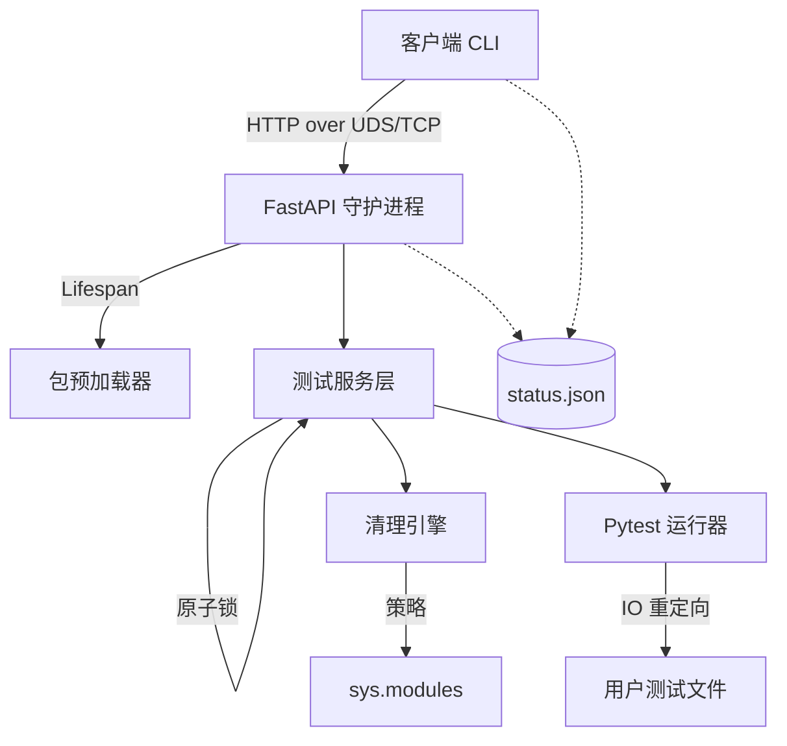

# Sprintest

[](https://pypi.org/project/sprintest/)
[](https://opensource.org/licenses/MIT)
[](https://www.python.org/downloads/)

[English](README.md) | [简体中文]

**Sprintest** 是一款专为重型 AI/ML 项目设计的 Client-Server (C/S) 架构测试运行器。

在涉及大型语言模型 (LLMs)、深度学习框架 (PyTorch, TensorFlow) 或海量数据集的项目中，传统的测试运行器启动极其缓慢（通常需要 30 秒到数分钟），因为每次运行都需要重新初始化整个环境。**Sprintest 通过将沉重的依赖项预先加载到内存中，彻底解决了这一痛点。**

---

## 🚀 核心亮点

- **⚡ 极速反馈**：将测试启动时间从分钟级降至毫秒级。通过后台 Daemon 进程保持框架和模型常驻内存，实现“即改即跑”。
- **🔄 智能热重载**：内置 "Nuke Engine"（模块清理引擎），能够外科手术般地仅卸载项目中已修改的模块，确保测试基于最新代码运行，同时无需重新加载重型依赖。
- **🔌 统一传输层**：自动感应环境，在 **Unix Domain Sockets (UDS)**（零延迟本地通信）与 **TCP**（最大兼容性）之间无缝切换。
- **🛠️ 解耦架构**：采用健壮的业务服务层和原子化状态管理，确保在重型测试执行期间通信依然稳定可靠。
- **🤖 开发者/Agent 友好**：专为 AI 编码助手（如 Antigravity, Cursor）优化，提供纯净的无 ANSI 输出和可靠的守护进程状态追踪。
- **🎯 可灵活配置**：支持通过 `pyproject.toml` 配置 `ignore_patterns`，防止特定的重型模块被意外重载。

---

## ⚡ 性能对比

对于包含重型依赖（如 `torch`, `transformers` 等）的 AI/ML 项目，Sprintest 通过消除重复的初始化过程，提供了巨大的性能提升。

| 运行方式 | 项目类型 | 总计耗时 |
| :--- | :--- | :--- |
| **Pytest (标准)** | AI/LLM 项目 | ~6.0s |
| **Sprintest (首次运行)** | AI/LLM 项目 | ~7.0s |
| **Sprintest (热启动)** | AI/LLM 项目 | **~2.0s** |

*基于 Mac Intel i7 与 DistilBERT 情感分析模型的实测数据。在大型模型项目中，实际加速效果通常可达 **10x - 20x**。*

---

## 🏗️ 项目架构

Sprintest 采用解耦架构，确保即使在执行繁重的测试任务时，守护进程依然能快速响应。



---

## 📦 安装

```bash
pip install sprintest
```

---

## 📖 快速上手

1. **运行测试**：
   直接运行 `stest` 命令。如果守护进程尚未启动，它会自动在后台启动。
   ```bash
   stest tests/test_model_loading.py
   ```

2. **查看守护进程状态**：
   ```bash
   stest status
   ```

3. **停止守护进程**：
   ```bash
   stest stop
   ```

---

## ⚙️ 配置说明

### 环境变量与隔离
- `SPRINTEST_TARGET_PKG`: 你正在开发的包名。Sprintest 会优先对该包进行热重载。
- `SPRINTEST_FORCE_TCP`: 设置为 `1` 时，强制使用 TCP 替代 Unix Sockets 通信。
- `SPRINTEST_PORT`: 自定义 TCP 端口（默认为 `8000`）。
- `SPRINTEST_DIR`: 覆盖默认的 `.sprintest` 目录（适用于多项目隔离或 CI 环境）。
- `SPRINTEST_LOCK_FILE`: 覆盖守护进程锁文件路径。
- `SPRINTEST_LOG_LEVEL`: 设置日志级别 (DEBUG, INFO, WARNING, ERROR)。

### 进阶配置：`pyproject.toml`
你可以通过配置忽略列表，防止特定模块在热重载时被清理：

```toml
[tool.sprintest]
ignore = [
    "torch.*",
    "transformers.*",
    "heavy_module_to_keep"
]
```

---

## 🧪 开发与测试

### 标准单元测试
```bash
uv run pytest tests
```

### 自举测试 (Bootstrap)
Sprintest 具备强大的自举能力，可以通过自身的守护进程运行自身的测试套件以验证稳定性：
```bash
stest tests
```

---

## 📄 开源协议

MIT License. 详见 [LICENSE](LICENSE) 文件。
